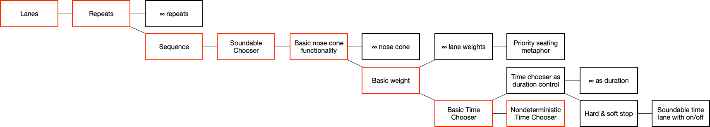
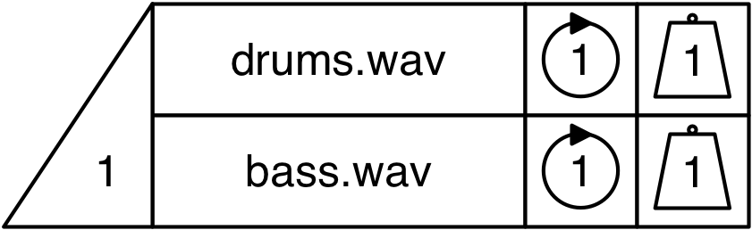
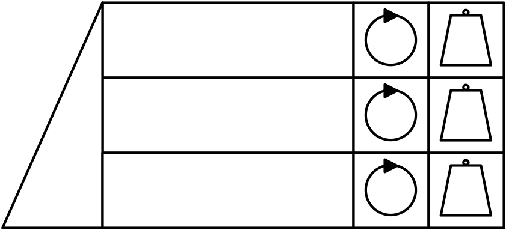
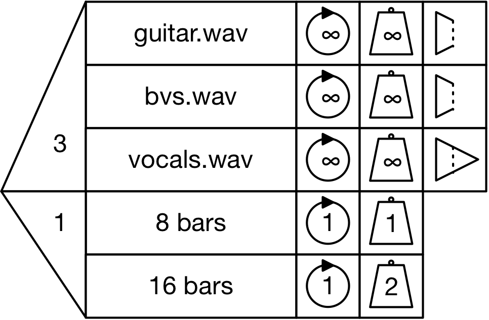

# Basic sequence

## Simple structure
Lanes
Repeats
Sequence

## Soundable Chooser basics
Soundable Chooser
Nose cone
Weight

## Infinity weight
∞ weight
Priority seating

## Full Chooser basics
Full Chooser, introducing the...
Time Chooser
Nose cone limitations for the Time Chooser
Hard and soft stops

## Advanced features
∞ nose cone
∞ duration
∞ repeats
Soundable content in a Time Chooser lane

# Second round user test questions

Questionnaire for participants: <https://goo.gl/forms/YHTjQz8HcXG0AEO52> 

## Scenario 1 - understanding the Soundable Chooser

**Video** introducing lanes, nose cone, weighting inc. infinity, repeats inc. infinite repeat. Clearly state that vertical lanes do not necessarily mean that they will play together.

Here is a **Soundable Chooser** with two samples. 

* If this Chooser is played by itself, how many samples will play? 
* How do you know? 
* How likely is it that the `drums.wav` sample will play? How could you make it more likely to play? 
* How could you make the Chooser play both samples? 
* How would you make it play no samples?

## Scenario 2 - creating a soundable chooser
Make a Soundable Chooser which has three lanes---those lanes should contain infinitely looping drums, bass and guitar samples. Make it so that two play at once---the drums always play, and either bass or guitar will be selected with equal probability.

* Make it so the guitar doesn’t play.
* Next, make it so all three play simultaneously.

## Scenario 3 - Time Choosers and Full Choosers

**Video** introducing Time Choosers (inc. nose cone restrictions and multiple lanes), Full Choosers with duration control via the Time Chooser, infinity as a duration, and hard and soft stops (with visual example).

Here is a Full Chooser, comprising the Soundable Chooser from Scenario 1 and a Time Chooser.

* Describe what will happen when this Chooser is run.
* The Time Chooser's nose cone is currently set to 1. What else could it be set to? What would happen if it is changed?

## Scenario 4 - creating a Full Chooser

> Create with these characteristics:
> 
> - Multiple soundable lanes
> - Nondeterministic soundable lane choice
> - Weights
> - Repeats inc. infinity
> - Mixture of stops
> - Time Chooser with two lanes, nondeterministic choice with weights
> 
> Add questions - predict effects of changing parameters
> Include rest functionality

## Scenario 5 - understanding a Full Chooser

* What do you expect to happen in the Soundable Chooser?
* [Be sure to check understanding of infinity in:]
	* Nose cone
	* Repeats
	* Weights
* What will the impact of the hard and soft stops be? What would happen if the vocals were changed to a hard stop?
* What would happen if the time nose cone stayed at 1 and the soundable nose cone was changed to 3? To 2? 1? To zero?
* What will happen in the Time Chooser?
	* Which lane is more likely to be selected?
	* What would happen if you changed the number of repeats for the 8 bar lane to '2'?
	* What will happen if the `drums.wav` lane is selected? Will we hear it? How can make it so the sample will be audible? 
* What other values are possible for the nose cone of the Soundable Chooser? What would happen in each case?
* What other values are possible for the nose cone of the Time Chooser? What would the consequences of each change be?
* How could the Chooser be made into a rest? Skipped entirely?

## Scenario 6 - creating a full chooser
Using the templates, create a full chooser which:

* Has four soundable lanes, three of which will play at any given time;
   * Drums and bass, which always play, are set to repeat infinitely with a hard stop;
   * Guitar and vocals - guitar is twice as likely as vocals to be selected for playback. Both should play once only. The guitar should have a hard stop, and the vocals should have a soft stop.
* Has three possible durations, of which one will be selected;
   * 2 bars;
   * 4 bars;
   * 5 bars;
   * Make the 2 bar duration twice as likely to be selected as the 4 and 5 bar durations.

## Scenario 7 - playground

**Video** - sequence

Using the templates and samples available, make a piece of music which uses a sequence of three choosers. The music will be recorded and shared online. 

The piece should be musically satisfying even if it is run only once. If it is run more than once it should be different in some way.

### Notes
* Introduction; what we are doing
* Questionnaire
* Information we are going to gather and agree as co-participants:
	* Questions (why does the loop do that?)
	* Problems (I don’t understand what these lanes are for)
	* Suggestions (maybe the cone should be a different shape)
	* Other observations (I like the fins)

Run through the tests. Are there any other ways to do that? Can you think of any other ways that could be done?

* Can you see anything this would be useful for?
* Can you see any ways in which this is similar to other tools you have used?
* Is there anything that is made easier by this system? Anything which was not possible made possible/hard and made easier?