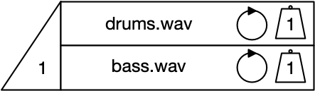
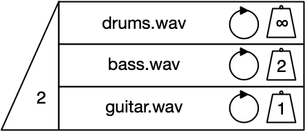
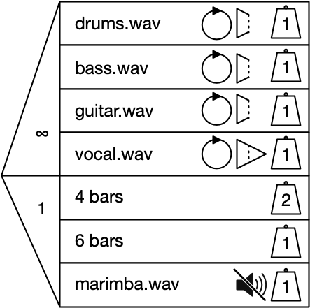

### Content and logical flow

```
             ┌────────────────────┐                                                  
             │       Lanes        │                                                  
             │                    │                                                  
             └────────────────────┘                                                  
                        │                                                            
                        ▼                                                            
             ┌────────────────────┐                                                  
             │      Repeats       │                                                  
             │                    │                                                  
             └────────────────────┘                                                  
                        │                                                            
                        ▼───────────────────────────┐                                
             ┌────────────────────┐                 ▼                                
             │      Sequence      │      ┌────────────────────┐                      
             │                    │      │     ∞ repeats      │                      
             └────────────────────┘      │                    │                      
                        │                └────────────────────┘                      
                        ▼                                                            
             ┌────────────────────┐                                                  
             │ Soundable Chooser  │                                                  
             │                    │                                                  
             └────────────────────┘                                                  
                        │                                                            
                        ▼                                                            
             ┌────────────────────┐                                                  
             │  Basic nose cone   │                                                  
             │   functionality    │                                                  
             └────────────────────┘                                                  
                        │                                                            
                        ▼───────────────────────────┐                                
             ┌────────────────────┐                 ▼                                
             │    Basic weight    │      ┌────────────────────┐                      
             │                    │      │    ∞ nose cone     │                      
             └────────────────────┘      │                    │                      
                        │                └────────────────────┘                      
                        ▼───────────────────────────┐                                
             ┌────────────────────┐                 │                                
             │ Basic Time Chooser │                 ▼                                
             │                    │      ┌────────────────────┐                      
             └────────────────────┘      │   ∞ lane weight    │                      
                        │                │                    │                      
                        │                └────────────────────┘                      
           ┌────────────┤                           │                                
           │            │                           ▼                                
           ▼            │                ┌────────────────────┐                      
┌────────────────────┐  │                │  Priority seating  │                      
│  Time Chooser as   │  │                │      metaphor      │                      
│  duration control  │  │                └────────────────────┘                      
└────────────────────┘  └─────────────────────────────────────────────────┐          
           │                                                              │          
           │                                                              │          
           ▼───────────────────────────────────┐                          │          
┌────────────────────┐                         │                          │          
│ Hard and soft stop │                         │                          │          
│                    │                         ▼                          │          
└────────────────────┘              ┌────────────────────┐                │          
           │                        │     ∞ duration     │                │          
           ▼                        │                    │                ▼          
┌────────────────────┐              └────────────────────┘     ┌────────────────────┐
│Soundable time lane │                                         │  Nondeterministic  │
│    with on/off     │                                         │    Time Chooser    │
└────────────────────┘                                         └────────────────────┘
```


### Proposed order
```
           ┌────────────────────┐                              
           │       Lanes        │                              
           │                    │                              
           └────────────────────┘                              
                      │                                        
                      ▼                                        
           ┌────────────────────┐                              
           │      Repeats       │                              
           │                    │                              
           └────────────────────┘                              
                      │                                        
                      ├──────────────┐                         
           ┌──────────┘              ▼                         
           │              ┌────────────────────┐               
           ▼              │      Sequence      │               
┌────────────────────┐    │                    │               
│     ∞ repeats      │    └────────────────────┘               
│                    │               │                         
└────────────────────┘               ▼                         
                          ┌────────────────────┐               
                          │ Soundable Chooser  │               
                          │                    │               
                          └────────────────────┘               
                                     │                         
                                     ▼                         
                          ┌────────────────────┐               
                          │  Basic nose cone   │               
                          │   functionality    │               
                          └────────────────────┘               
                                     │                         
                                     ▼                         
                          ┌──────────┴─────────┐               
                          │    Basic weight    │               
                          │                    │               
                          └──────────┬─────────┘               
                                     │                         
                                     ├──────────────┐          
                                     │              ▼          
                                     │   ┌────────────────────┐
                                     │   │   ∞ lane weight    │
                                     │   │                    │
                            ┌────────┤   └────────────────────┘
                            │        │              │          
                            │        │              ▼          
                            │        │   ┌────────────────────┐
                            │        │   │  Priority seating  │
                            │        │   │      metaphor      │
                            ▼        │   └────────────────────┘
                 ┌───────────────────┼┐                        
                 │Basic Time Chooser,││                        
                 │    Full Chooser   ││                        
                 └───────────────────┼┘                        
              ┌─────────────┐        │                         
              │             ▼        │                         
              │  ┌───────────────────┼┐                        
              │  │  Time Chooser as  ││                        
              │  │  duration control ││                        
              │  └───────────────────┼┘                        
              │             ┌────────┼──────────────┐          
              │             ▼        │              ▼          
              │  ┌───────────────────┼┐  ┌────────────────────┐
              │  │ Hard and soft stop││  │     ∞ duration     │
              │  │                   ││  │                    │
              │  └───────────────────┼┘  └────────────────────┘
              │             ─────────┼───────────┐             
              ▼                      │           │             
   ┌────────────────────┐            │           │             
   │  Nondeterministic  │            │           │             
   │    Time Chooser    │            │           │             
   └────────────────────┘            ▼           │             
                          ┌────────────────────┐ │             
                          │    ∞ nose cone     │ │             
                          │                    │ │             
                          └────────────────────┘ │             
                                                 ▼             
                                      ┌────────────────────┐   
                                      │Soundable time lane │   
                                      │    with on/off     │   
                                      └────────────────────┘   
```


## Simple structure
* Lanes
* Repeats
* Sequence

## Soundable Chooser basics
* Soundable Chooser
* Nose cone
* Weight

## Infinity weight
* ∞ weight
* Priority seating

## Full Chooser basics
* Full Chooser, introducing the...
* Time Chooser
* Nose cone limitations for the Time Chooser
* Hard and soft stops

## Advanced features
* Nondeterministic Time Chooser
* ∞ nose cone
* ∞ duration
* ∞ repeats
* Soundable content in a Time Chooser lane


# Second round user test questions

Questionnaire for participants: <https://goo.gl/forms/YHTjQz8HcXG0AEO52> 


## S1: Basics

### Understanding

*Video introducing samples, lanes, repeats, and sequence*


* How many times will the bass.wav sample play? How could you make it play four times?
* How could you change the order of the sequence?
* How could you change the amen.wav sample from 2 to 4 repetitions?


### Implementing

Update the example to do the following:

* Amen break, repeated twice;
* Bass sample, repeated twice;
* Add a guitar sample to the sequence, triggering after the bass sample. Set the guitar sample to repeat four times.


## S2: Soundable Chooser basics

### Understanding
*Video introducing Soundable Choosers, including the nose cone and the weight column*

We want to introduce some nonlinearity - in this case, we want the system to choose between two different samples. We want to make a Chooser which will play either drums or bass. 



* If this Chooser is played by itself, how many samples will play? How do you know? 
* How likely is it that the `drums.wav` sample will play? How could you make it more likely to play? 
* How could you make the Chooser play both samples? 
* How would you make it play no samples?


### Implementing

Using the whiteboard, draw a Soundable Chooser for the following scenario:

A producer wants a Chooser which will select and play two out of three samples; `drums.wav`, `bass.wav`, and `guitar.wav`. They want all the samples to play four times before stopping, and they want the drums to be twice as likely to be selected as the other samples.


## S3: Infinity weight
*Video introducing infinity weight and the priority seating and lottery analogy, with visual aids*

### Understanding

Sometimes you will want to make sure that one or more lanes are selected. In this instance, the producer wants to make sure that the music always has a drum track, with either a bass or guitar part playing at the same time.



* What will happen when this Soundable Chooser runs?
	* [discussion to test understanding]
		* Two lanes will be selected
		* Infinity weighted lane gets 'priority seating'
		* There is a lottery for the remaining 'seat', and `bass.wav` is more likely to be selected


### Implementation

Using the whiteboard, draw a Soundable Chooser for the following scenario:

The producer wants a Chooser which will always play the `drums.wav` and `bass.wav` samples. The Chooser needs to also play either `guitar.wav` or `marimba.wav`; `marimba.wav` needs to be twice as likely to be picked as `guitar.wav`.


## S4: Full Chooser basics
### Understanding

*Video introducing a Time Chooser to a Soundable Chooser, making a Full Chooser; the nose cone limitations for a Time Chooser; infinity repeats; and hard and soft stops (with visuals).*

The producer needs to limit the overall duration of the Chooser, but they want to let the vocal sample finish playing if it is longer than 4 bars. The vocal is the most important element in this musical section and so it has to play; it should be accompanied by either drums or bass. Whichever supporting instrument is chosen, it should stop as soon as the duration of 4 bars is reached.


* Describe what will happen when this Full Chooser is run.
* What will happen when the Time Chooser's duration has elapsed? 
* The Time Chooser's nose cone is currently set to 1. What else could it be set to? What would happen if it is changed?


### Implementation

Using the example above as a starting point, the producer needs to create the next musical section. The Chooser needs to do the following;

* Select and play four out of six samples; the samples are `drums.wav`, `bass.wav`, `guitar.wav`, `marimba.wav`, `bvs.wav`, and `vox.wav`
* The `vox.wav` and `marimba.wav` samples are essential to the track, so they always have to be selected
* Of the other samples, the drums should be more likely to be selected
* The Chooser should run for a minimum of 8 bars, with all samples looping
* The vocal tracks (`vox.wav`, `bvs.wav`) should be allowed to finish playing. The other tracks should stop as soon as 8 bars has elapsed.


## S5: Advanced features
### Understanding
*Video introducing ∞ for the Soundable nose cone, and ∞ as a duration in a Time Chooser; multiple lanes in a Time Chooser, including weighted choice and nose cone limitations; soundable content in a Time Chooser, including mute/non-mute.*

The producer wants to hear all the lanes of the Soundable Chooser, and so uses ∞ in the nose cone. All lanes are looping, and the Chooser will have a duration of 4, 6, or 8 bars. A 4 bar duration is twice as likely as the other two options. Regardless of the duration, the vocal’s soft stop means that it will play in its entirety before stopping. The other samples will stop immediately as soon as the duration has elapsed.



* Explain what will happen in the Time Chooser
* What effect will this duration have on the Soundable Chooser lanes?
* In the Soundable Chooser, which lanes will be selected, and which may be selected? What is the likelihood of selection?
* In the Soundable Chooser, what effect will the repeat settings have?
* What effect will the Soundable nose cone setting have?

### Implementation

Sketch out the previous example on the whiteboard, and make the following changes:

* Make the Full Chooser play infinitely
* Make it so 2 lanes are chosen, and make all lanes equally likely to be selected
* Next, make it so the Full Chooser has a duration of either 4 or 8 bars, with hard stops on all lanes
* Next, create a sequence with the Full Chooser playing 4 times in a row
]
## S6: Playground

Using the whiteboard and the available samples, make a piece of music which uses a sequence of three Choosers. The music will be recorded and shared online.

The piece should be musically satisfying even if it is run only once. If it is run more than once it should be different in some way.


----

### Notes
* Introduction; what we are doing
* Questionnaire
* Information we are going to gather and agree as co-participants:
	* Questions (why does the loop do that?)
	* Problems (I don’t understand what these lanes are for)
	* Suggestions (maybe the cone should be a different shape)
	* Other observations (I like the fins)


Run through the tests. Are there any other ways to do that? Can you think of any other ways that could be done?

* Can you see anything this would be useful for?
* Can you see any ways in which this is similar to other tools you have used?
* Is there anything that is made easier by this system? Anything which was not possible made possible/hard and made easier?