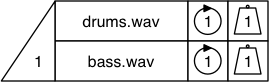
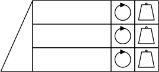
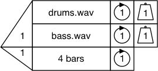
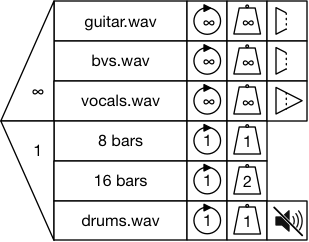

# Second round user test questions

Questionnaire for participants: <https://goo.gl/forms/YHTjQz8HcXG0AEO52> 

## Scenario 1 - understanding the Soundable Chooser

**Video** introducing lanes, nose cone, weighting inc. infinity, repeats inc. infinite repeat.

Here is a **Soundable Chooser** with two samples. 

* If this Chooser is played by itself, how many samples will play? 
* How do you know? 
* How likely is it that the `drums.wav` sample will play? How could you make it more likely to play? 
* How could you make the Chooser play both samples? 
* How would you make it play no samples?

## Scenario 2 - creating a soundable chooser
Make a Soundable Chooser which has three lanes---those lanes should contain infinitely looping drums, bass and guitar samples. Make it so that two play at once---the drums always play, and either bass or guitar will be selected with equal probability.

* Make it so the guitar doesn’t play.
* Next, make it so all three play simultaneously.

## Scenario 3 - understanding the time chooser

**Video** introducing Time Choosers, multiple-lane Time Choosers, and Time Chooser nose cone restrictions.

Here is a Time Chooser with two lanes.

* Describe what will happen when this chooser is run by itself.
* The nosecone is currently set to 1. What else could it be set to? What would happen if it is changed?
* How could you make a duration of 2 bars most likely to be selected?

## Scenario 4 - creating a single-lane time chooser
Keeping the soundable chooser you made for scenario 2, create a single-lane time chooser.

Make a four bar rest.

* Now you have made the rest, find two ways to quickly skip it. What do you think the nose cone value could be? What would happen if you gave the nose cone that value?
* What impact would there be if you changed the weight of the lane?

**Video** introducing Full Choosers, duration control via the Time Chooser, and hard and soft stops.

Next, take the Time Chooser and snap it onto the Soundable Chooser created in scenario 2. What is the impact of this?

## Scenario 5 - understanding a full chooser
Look at this Chooser and say what will happen when the Chooser is played. The `drums` and `bass` samples are four bars long. The `marimba` sample is two bars long.

* How many samples will play? Will they loop or play once? What effect would changing the loop setting on the drums have?
* How long will the chooser play for? What happens when the duration elapses?
* What would happen if the time chooser was set to a soft stop?
* What would happen if the time nose cone stayed at 1 and the soundable nose cone was changed to 2? To 1? To zero?
* How could you make it infinite playback? How could it be made into a rest? Skipped entirely?

## Scenario 6 - understanding a full chooser with multiple lane times
Here is a chooser containing a time chooser with multiple lanes.

* What do you expect to happen in the soundable chooser?
* What will happen in the time chooser? Which lane is more likely to be selected? What are the consequences of the selection of the uppermost time chooser lane? What will be different if the lower time chooser lane is selected?
* What other values are possible for the nose cone of the soundable chooser?
* What other values are possible for the nose cone of the time chooser?

## Scenario 7 - creating a full chooser
Using the templates, create a full chooser which:

* Has four soundable lanes, three of which will play at any given time;
   * Drums and bass, which always play, and are set to loop;
   * Guitar and vocals - guitar is twice as likely as vocals to be selected for playback. Neither should loop.
* Has three possible durations, of which one will be selected;
   * 2 bars with a hard stop;
   * 4 bars with a soft stop;
   * 5 bars with a hard stop;
   * Make the 2 bar duration twice as likely to be selected as the 4 and 5 bar durations.

## Scenario 8 - playground

Video - sequence

Using the templates and samples available, make a piece of music which uses a sequence of three choosers. The music will be recorded and shared online. 

The piece should be musically satisfying even if it is run only once. If it is run more than once it should be different in some way.

* Introduction; what we are doing
* Questionnaire
* Information we are going to gather and agree as co-participants:
	* Questions (why does the loop do that?)
	* Problems (I don’t understand what these lanes are for)
	* Suggestions (maybe the cone should be a different shape)
	* Other observations (I like the fins)

Run through the tests. Are there any other ways to do that? Can you think of any other ways that could be done?

* Can you see anything this would be useful for?
* Can you see any ways in which this is similar to other tools you have used?
* Is there anything that is made easier by this system? Anything which was not possible made possible/hard and made easier?