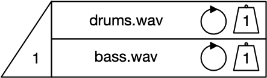
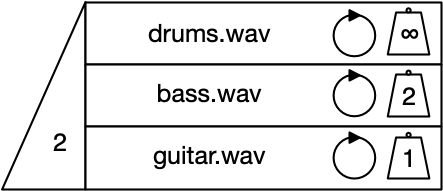
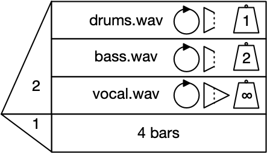
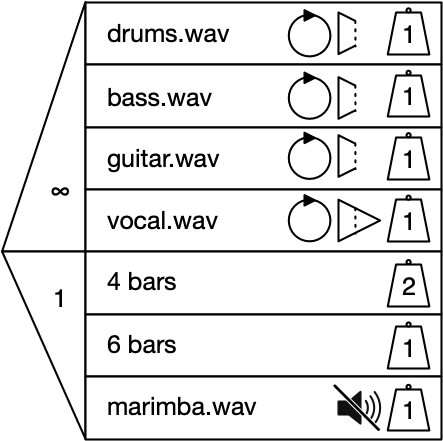

# Second round user test questions

Questionnaire for participants: <https://goo.gl/forms/YHTjQz8HcXG0AEO52> 

## S1: Basics

### Understanding

[Video introducing samples, lanes, and sequence](https://drive.google.com/open?id=1lqOKdtT_aOUxWGKZLOxvmn0SmUNCozLi)

* What will happen when this runs?
* How could you change the order of the sequence?

### Implementing

Using the whiteboard, update the sequence to play the marimba, then the bass hook, then the marimba again, then stop.

## S2: Soundable Chooser basics

### Understanding
[Video introducing Soundable Choosers, including the nose cone, loop/non-loop, and the weight column](https://drive.google.com/open?id=1zhSXcoJmZPV68NwzXjhqHdTR-eEBmqL9)

We want to introduce some chance - in this case, we want the system to choose between two different samples. We want to make a Chooser which will play either drums or bass. 

* If this Chooser is played by itself, how many samples will play? How do you know? 
* How likely is it that the `drums.wav` sample will play? How could you make it more likely to play? 
* How could you make the Chooser play both samples? 
* How would you make it play no samples?

### Implementing

Using the whiteboard, draw a Soundable Chooser for the following scenario:

You want a Chooser which will select and play two out of three samples; `drums.wav`, `bass.wav`, and `guitar.wav`. You want the samples to loop, and you want the drums to be twice as likely to be selected as any other sample.

## S3: Infinity weight
[Video introducing infinity weight and the priority seating and lottery analogy](https://drive.google.com/open?id=1oIViHs88u2Z-Ogaw3Vc3L-ePHnhrID99)

### Understanding

Sometimes you will want to make sure that one or more lanes are selected. In this instance, the artist wants to make sure that the music always has a drum track, with either a bass or guitar part playing at the same time.

* What will happen when this Soundable Chooser runs?
	* [discussion to test understanding]
		* Two lanes will be selected
		* Infinity weighted lane gets 'priority seating'
		* There is a lottery for the remaining 'seat', and `bass.wav` is more likely to be selected

### Implementation

Using the whiteboard, draw a Soundable Chooser for the following scenario:

You want a Chooser which will always play the `drums.wav` and `bass.wav` samples. The Chooser needs to also play either `guitar.wav` or `marimba.wav`; `marimba.wav` needs to be twice as likely to be picked as `guitar.wav`.

## S4: Full Chooser basics
### Understanding

[Video introducing a Time Chooser to a Soundable Chooser, making a Full Chooser; the nose cone limitations for a Time Chooser; infinity repeats; and hard and soft stops](https://drive.google.com/open?id=1Lr66_zq6pecRcTEl20xNKm4b3N_D9e1H)

In the example shown here, the artist needs to limit the overall duration of the Chooser but they also want to let the vocal play to the end of the sample once it has started. The vocal is the most important element in this musical section and so it has to play; it should be accompanied by either drums or bass. Whichever supporting instrument is chosen, it will stop as soon as the duration of 4 bars has elapsed.

* Describe what will happen when this Full Chooser is run.
* What will happen when the Time Chooser's duration has elapsed? 
* The Time Chooser's nose cone is currently set to 1. What else could it be set to? What would happen if it is changed?

### Implementation

Using the example above as a starting point, you need to create the next musical section. The Chooser for the new section needs to do the following;

* Select and play four out of six samples; the samples are `drums.wav`, `bass.wav`, `guitar.wav`, `marimba.wav`, `bvs.wav`, and `vox.wav`;
* The `vox.wav` and `marimba.wav` samples are essential to the track, so they always have to be selected;
* Of the other samples, the drums should be more likely to be selected;
* The Chooser should run for a minimum of 6 bars, with all samples looping;
* The vocal tracks (`vox.wav`, `bvs.wav`) should be allowed to finish playing. The other tracks should stop as soon as 8 bars has elapsed.

## S5: Advanced features
### Understanding
[Video introducing ∞ for the Soundable nose cone, and ∞ as a duration in a Time Chooser; multiple lanes in a Time Chooser, including weighted choice and nose cone limitations; and soundable content in a Time Chooser, including mute/non-mute](https://drive.google.com/open?id=1cJD3RWNmRW6ngfZN0EA4KPd6Vfwz8cGG)

In this example, the artist wants to hear all the lanes of the Soundable Chooser, and so uses ∞ in the nose cone. All lanes are looping, and the Chooser will have a duration of 4 or 6 bars, or it will use the duration of the `marimba.wav` sample. A 4 bar duration is twice as likely as the other two options. Regardless of the duration, the vocal’s soft stop means that it will play in its entirety before stopping. The other samples will stop immediately as soon as the duration has elapsed.

* Explain what will happen in the Time Chooser
* What effect will the Time Chooser's selected duration have on the Soundable Chooser lanes?
* How could we make the `marimba.wav` sample audible if it is selected?
* In the Soundable Chooser, which lanes will be selected?
* What effect will the Soundable nose cone setting have? How could you quickly change the Chooser to play two of the four samples?

### Implementation

Sketch out the previous example on the whiteboard, and make the following musical changes:

* Make it so 2 lanes are chosen; the vocal and one other instrument
* Make it so the Full Chooser has a duration of either 4 or 8 bars, with hard stops on all lanes
* Next, create a second Chooser and sequence it so it plays before this Chooser. The new Chooser should have the following characteristics:
	* Drums and bass should always play, and should loop until hard-stopped;
	* Either the vocal or backing vocals should play, looping until soft-stopped. The choice between them should be equal;
	* The Chooser should have a duration of 4 or 8 bars, with a 4 bar duration three times more likely to be chosen than an 8 bar duration.

## S6: Playground

Using the whiteboard and the available samples, make a piece of music which uses a sequence of three Choosers. The music will be recorded and shared online.

The piece should be musically satisfying even if it is run only once. If it is run more than once it should be different in some way.

# Not currently included in the test - advanced features
* Repeats in lanes [x2], increasing the atomic length of the contents
* A specific number of loops in the loop icon - only on/off currently introduced
* Nesting

----

### Notes
* Introduction; what we are doing
* Questionnaire
* Information we are going to gather and agree as co-participants:
	* Questions (why does the loop do that?)
	* Problems (I don’t understand what these lanes are for)
	* Suggestions (maybe the cone should be a different shape)
	* Other observations (I like the fins)

Run through the tests. Are there any other ways to do that? Can you think of any other ways that could be done?

* Can you see anything this would be useful for?
* Can you see any ways in which this is similar to other tools you have used?
* Is there anything that is made easier by this system? Anything which was not possible made possible/hard and made easier?